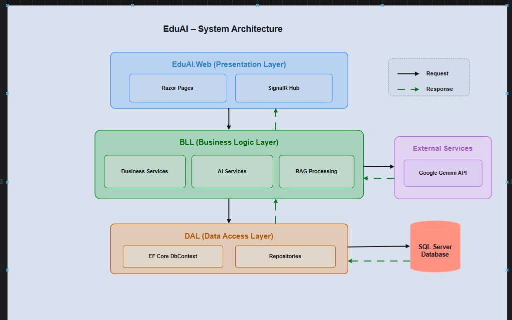

# Smart Study Buddy - RAG Chatbot học tập

Smart Study Buddy là ứng dụng web hỗ trợ sinh viên hỏi đáp dựa trên tài liệu môn học. Hệ thống cho phép quản lý tài liệu, upload và index nội dung, tìm kiếm ngữ cảnh liên quan bằng cơ chế RAG, sau đó dùng Gemini để sinh câu trả lời tiếng Việt có trích dẫn nguồn.

## Tính năng chính

- Đăng nhập, đăng ký và phân quyền người dùng theo vai trò `Admin`, `Teacher`, `Student`.
- Quản lý môn học, bộ môn và phân công giáo viên phụ trách môn.
- Upload tài liệu học tập theo bộ môn, môn học, chương và giảng viên.
- Hỗ trợ đọc nội dung từ `PDF`, `DOCX`, `PPTX`, `TXT`, `MD`, `CSV` hoặc nhập nội dung thủ công.
- Tự động chia tài liệu thành các chunk để phục vụ truy xuất.
- Chatbot hỏi đáp theo ngữ cảnh tài liệu, có lưu lịch sử hội thoại.
- Hiển thị nguồn tài liệu được dùng để tạo câu trả lời.
- Danh sách tài liệu realtime bằng Blazor Server và SignalR.
- Benchmark cơ bản cho retrieval/generation để đánh giá chất lượng hệ thống.

## Công nghệ sử dụng

- ASP.NET Core Razor Pages
- Blazor Server
- SignalR
- Entity Framework Core
- SQL Server LocalDB
- Gemini API
- DocumentFormat.OpenXml
- UglyToad.PdfPig
- .NET 10

## Kiến trúc project

```text
ass2/
├── ass2/                  # Web app: Razor Pages, Blazor components, SignalR hub
│   ├── Components/        # Blazor components
│   ├── Hubs/              # SignalR hub
│   ├── Pages/             # Razor Pages
│   └── Program.cs         # Cấu hình DI, auth, database, routing
├── BLL/                   # Business logic layer
│   ├── Models/            # DTO/record models
│   └── Services/          # Auth, knowledge base, Gemini, benchmark
├── DAL/                   # Data access layer
│   └── Data/
│       └── AppDbContext.cs
├── ERD.md                 # Sơ đồ ERD bằng Mermaid
└── ass2.slnx
```

## Cơ sở dữ liệu

Ứng dụng sử dụng SQL Server LocalDB với database mặc định:

```text
Ass2RagChatbot
```

## Sơ đồ ERD / kiến trúc hệ thống



Các bảng chính:

- `Documents`: lưu tài liệu đã upload/index.
- `DocumentChunks`: lưu các đoạn nội dung đã chia nhỏ từ tài liệu.
- `ChatTurns`: lưu lịch sử hỏi đáp.
- `SourceMatches`: lưu nguồn tài liệu được truy xuất cho từng câu trả lời.
- `Users`: lưu tài khoản demo.
- `Subjects`: lưu danh mục môn học.
- `TeacherSubjects`: bảng trung gian phân công giáo viên với môn học.

ERD chi tiết nằm trong file [ERD.md](./ERD.md).

## Tài khoản demo

Khi chạy lần đầu, hệ thống tự seed dữ liệu mẫu:

| Username | Password | Vai trò | Ghi chú |
| --- | --- | --- | --- |
| `admin` | `123` | Admin | Quản lý user, môn học, phân quyền |
| `gv_prn` | `123` | Teacher | Trưởng bộ môn PRN222 |
| `gv_ai` | `123` | Teacher | Trưởng bộ môn AI |
| `gv_thuong` | `123` | Teacher | Giáo viên thường |
| `hocsinh` | `123` | Student | Sinh viên demo |

## Cài đặt môi trường

Yêu cầu:

- .NET SDK 10
- SQL Server LocalDB hoặc SQL Server tương thích
- Gemini API key nếu muốn dùng AI để sinh câu trả lời

Kiểm tra .NET:

```bash
dotnet --version
```

## Cấu hình

Connection string mặc định nằm trong `ass2/appsettings.json` và `ass2/appsettings.Development.json`:

```json
{
  "ConnectionStrings": {
    "DefaultConnection": "Server=(localdb)\\MSSQLLocalDB;Database=Ass2RagChatbot;Trusted_Connection=True;Encrypt=False;TrustServerCertificate=True;MultipleActiveResultSets=true"
  }
}
```

Nên cấu hình Gemini API key bằng User Secrets hoặc biến môi trường thay vì commit trực tiếp lên GitHub.

Ví dụ dùng User Secrets:

```bash
cd ass2
dotnet user-secrets init --project ass2/ass2.csproj
dotnet user-secrets set "Gemini:ApiKey" "YOUR_GEMINI_API_KEY" --project ass2/ass2.csproj
dotnet user-secrets set "Gemini:Model" "gemini-flash-latest" --project ass2/ass2.csproj
```

Hoặc dùng biến môi trường:

```bash
set Gemini__ApiKey=YOUR_GEMINI_API_KEY
set Gemini__Model=gemini-flash-latest
```

## Cách chạy project

Restore package:

```bash
dotnet restore
```

Build project:

```bash
dotnet build
```

Chạy web app:

```bash
dotnet run --project ass2/ass2.csproj
```

Sau đó mở URL được in ra trong terminal, thường là:

```text
https://localhost:xxxx
http://localhost:xxxx
```

Khi ứng dụng khởi động, `Program.cs` sẽ gọi:

- `authService.EnsureReady()` để tạo/kiểm tra bảng user, subject và phân quyền.
- `knowledgeBase.SeedAsync()` để tạo database, schema và tài liệu mẫu nếu chưa có dữ liệu.

## Luồng sử dụng

1. Đăng nhập bằng tài khoản demo.
2. Admin tạo môn học, phân quyền và gán môn cho giáo viên.
3. Trưởng bộ môn upload tài liệu theo môn học và chương.
4. Hệ thống trích xuất nội dung, chia chunk và lưu embedding đơn giản dạng vector.
5. Sinh viên đặt câu hỏi trong tab Chat.
6. Hệ thống tìm các chunk liên quan, gửi ngữ cảnh sang Gemini và trả lời kèm nguồn.

## Phân quyền

- `Admin`: quản lý role, môn học, phân công giáo viên.
- `Teacher`: xem tài liệu theo môn được phân công.
- `Teacher` là trưởng bộ môn: có quyền upload tài liệu cho bộ môn đang quản lý.
- `Student`: hỏi đáp và xem nội dung học tập được cung cấp.

## Ghi chú về RAG

Pipeline xử lý tài liệu nằm trong `BLL/Services/KnowledgeBaseService.cs`:

- Trích xuất text từ file upload.
- Chia nội dung thành chunk với overlap.
- Tạo embedding nội bộ bằng hashing token 256 chiều.
- Tính cosine similarity kết hợp token matching để chọn nguồn phù hợp.
- Gọi Gemini API để sinh câu trả lời dựa trên nguồn truy xuất.
- Nếu không có Gemini API key hoặc API lỗi, hệ thống dùng câu trả lời fallback từ nguồn tìm được.

## Bảo mật

Repository không nên public API key, password thật hoặc connection string production. Trước khi đưa lên GitHub, hãy:

- Xóa API key thật khỏi `appsettings.json` và `appsettings.Development.json`.
- Dùng User Secrets cho môi trường local.
- Dùng biến môi trường hoặc secret manager khi deploy.
- Không dùng password demo cho môi trường thật.

## Tài liệu liên quan

- [ERD.md](./ERD.md): sơ đồ thực thể và quan hệ database.
- `DAL/Data/AppDbContext.cs`: định nghĩa DbContext và entity.
- `BLL/Services/KnowledgeBaseService.cs`: xử lý tài liệu, RAG và chat.
- `BLL/Services/DemoAuthService.cs`: xử lý tài khoản, role, môn học.
- `BLL/Services/GeminiAiService.cs`: gọi Gemini API.
